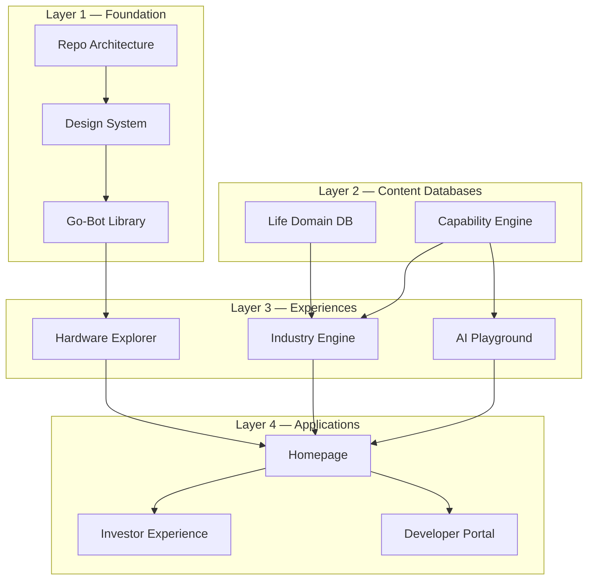

# The Go-Bot Experience Platform (GXP)

This repository is not a website. It is a platform; the homepage is one
application running on top of it. The same component library, Go-Bot
character system, capability database, and design system will power the
marketing site, investor portal, developer docs, kiosk demos, dashboards,
and every future ENGAGE GLOBAL surface.

## The ten phases, sorted into platform layers

The build plan maps onto four platform layers. Phases are cumulative —
each one is data or components the next one reuses.

| Phase | Deliverable | Status | Where |
| --- | --- | --- | --- |
| 1 | Foundation repository | ✅ Shipped | Whole repo — see [folder structure](folder-structure.md) |
| 2 | Design system | ✅ Shipped | `src/components/ui` + [docs](../design-system/README.md) |
| 3 | Go-Bot component library | ✅ Shipped | `src/components/gobot` — moods, roles, presets |
| 4 | Life domain database | ✅ All 20 domains populated | `src/data/life-domains.ts` + `life-domain-details.ts` |
| 5 | Capability engine | ✅ Engine + seed set | `src/data/capabilities.ts` + `/capabilities` |
| 6 | Hardware explorer (17 parts) | ✅ Shipped on the real renders (front/back hotspots) | `src/data/hardware.ts` + homepage |
| 7 | Industry engine | ✅ Shipped | `src/data/industries.ts` + `/industries/[slug]` |
| 8 | AI playground | ✅ Scripted; live in V3 | `src/components/sections/ai-demo.tsx` |
| 9 | Investor experience | 📋 Planned (V3) | Future `app/(investors)` route group |
| 10 | Developer portal | 📋 Planned (V3) | Future `app/(developers)` + `docs/developer/api` |

## The platform rule

**Experiences render databases through components.** Nothing is hardcoded:

- A new **life domain** = one entry in `life-domains.ts` (+ optional
  details) → grid card, page, search, and cross-references appear.
- A new **capability** = one entry in `capabilities.ts` → searchable in
  the engine, surfaced on every domain and industry page it references.
- A new **industry** = one entry in `industries.ts` → homepage card and a
  full transformed experience at `/industries/[id]`.
- A new **Go-Bot expression** = a film clip added to `GoBotFigure`'s
  media set (canonical), or a mood in `go-bot.moods.ts` for the
  illustration library.

Integrity is enforced by tests (`tests/unit/data.test.ts`): cross-references
must resolve, confidence must be a percentage, ids must be stable.

## Folder mapping (proposed layout → this repo)

| Proposed | Here | Why |
| --- | --- | --- |
| `components/{ui,layout,sections,gobot,3d,cards}` | `src/components/{ui,layout,sections,gobot,…}` | Same split, under `src/` per Next.js convention |
| `components/animations` | `src/animations` + `src/components/motion` | Tokens/variants vs. motion wrapper components |
| `components/timeline`, `icons` | `sections/roadmap.tsx`, Lucide + `ui/logo.tsx` | Promote to folders when they grow past single files |
| `lib` / `hooks` / `data` / `styles` | `src/lib` / `src/hooks` / `src/data` / `globals.css` tokens | Identical roles |
| `content` | `src/data` (typed) | Same brain; becomes CMS-backed in V3 without component changes |
| `design-system` | `src/components/ui` + `docs/design-system` | Code and documentation of the same system |
| `api` | `app/api` (V3) | Ships with the first server capability |
| `public/{images,models,videos,icons}` | `public/assets/{images,models,video,gobot}` | `models/` reserved should a 3D pipeline ever be commissioned |

## Multi-application future

When the second application arrives (investor portal, kiosk, dashboard),
it lands as a Next.js route group sharing every layer below it. When a
third arrives, `ui/`, `gobot/`, `animations/`, `types/`, and `data/`
graduate to workspace packages (`@gobot/ui`, `@gobot/character`,
`@gobot/content`) with unchanged import aliases. Nothing needs rewriting —
that is the point of building the platform first.
