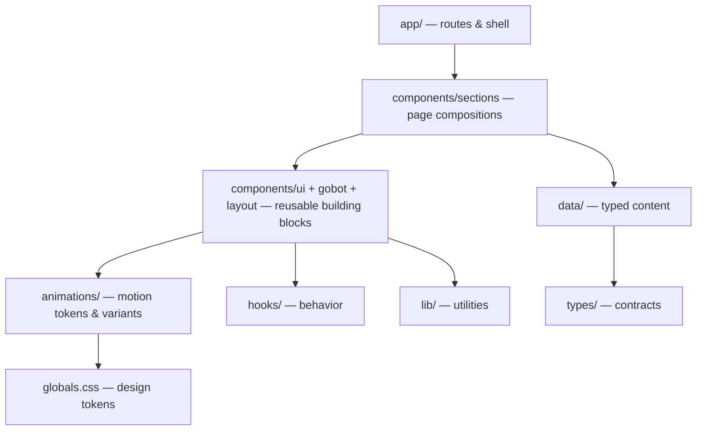

# Architecture Overview

## Goals

This platform is architected for a repository that will eventually exceed one
million lines of code. Every decision optimizes for:

1. **Scale** — new surfaces (dashboard, developer portal, marketplace) slot in without rework.
2. **Reuse** — one implementation per concept; zero duplication.
3. **Replaceability** — layers depend on contracts, not internals.
4. **Performance** — heavy modules (GSAP, media) load only where used.

## Layered architecture

**Dependency rule:** arrows point downward only. A lower layer never imports
from a higher one — `ui/` never imports from `sections/`, `hooks/` never
import components, `data/` never imports UI.

### Layer responsibilities

| Layer | Owns | Never contains |
| --- | --- | --- |
| `app/` | Routing, metadata, shell composition | Business/visual logic |
| `components/sections/` | Page-level compositions | Raw styling primitives, hardcoded copy |
| `components/ui/` | Design-system primitives | Page knowledge, content |
| `components/gobot/` | The character & his behaviors | Page layout |
| `animations/` | Timing tokens, variants, GSAP setup | Component markup |
| `hooks/` | Reusable stateful behavior | JSX |
| `data/` | Typed content | Rendering logic |
| `types/` | Shared contracts | Implementations |
| `lib/` | Pure utilities | React |

## Content-as-data

All marketing copy lives in `src/data/*` as typed structures. Sections render
whatever the data provides. This gives us: single-source content edits,
testable content integrity (see `tests/unit/data.test.ts`), and a direct
migration path to a CMS in a later version without touching components.

## Client/server split

Pages are server components by default. `'use client'` appears only where
interactivity demands it (animations, state, pointer tracking).

## Motion architecture

Three tiers, one vocabulary (see [motion philosophy](../design/motion-philosophy.md)):

1. **CSS keyframes** (`globals.css`) — ambient loops (pulse, float).
2. **Motion variants** (`animations/variants.ts`) — entrances & interactions.
3. **GSAP + ScrollTrigger** (`animations/gsap.ts`) — scroll choreography (V2+).

All three consume the same timing tokens (`animations/tokens.ts` mirrors the
CSS custom properties), so the whole site moves in one physical language.

## Scaling roadmap for the codebase

- **Multiple surfaces:** future apps live as sibling route groups in `app/`
  (e.g. `app/(marketing)`, `app/(dashboard)`) sharing the same component layers.
- **Package extraction:** when a second app appears, `ui/`, `animations/`,
  `types/`, and `lib/` graduate into workspace packages with unchanged import
  paths via aliases.
- **API:** server logic will live in `app/api` with contracts in `types/`,
  documented under `docs/developer/api/`.
